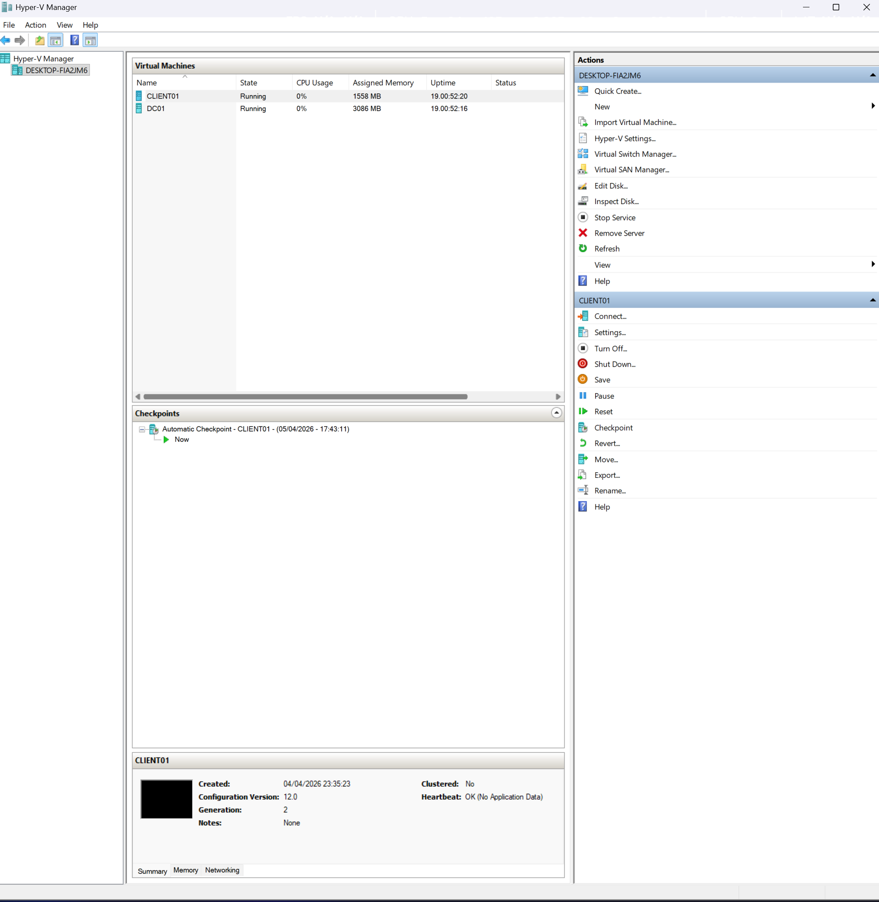
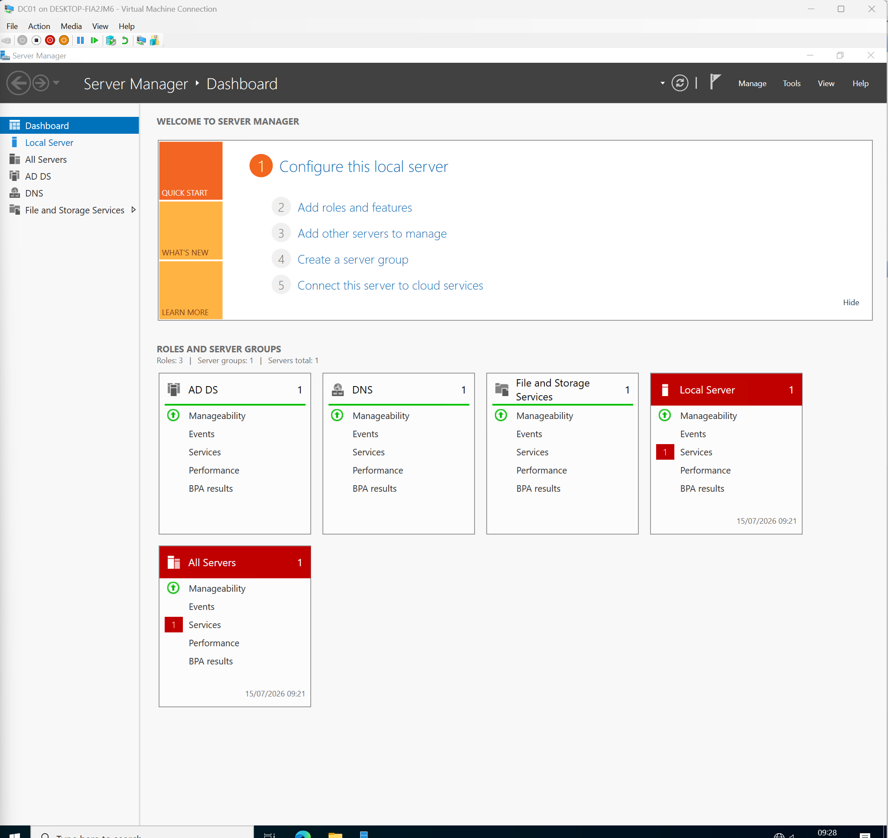
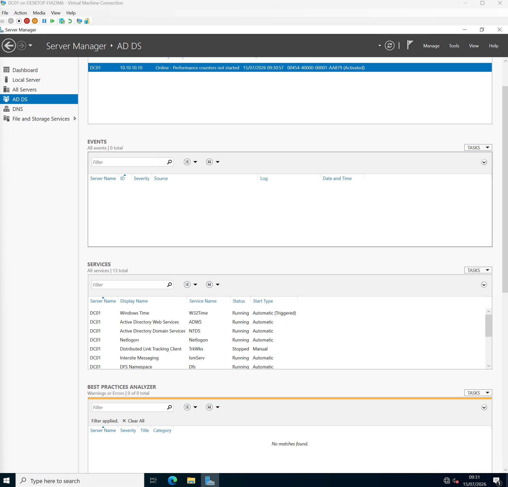
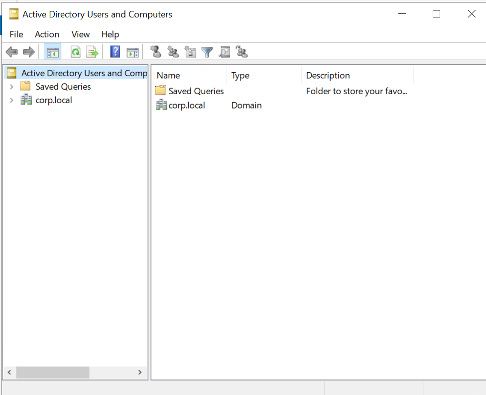
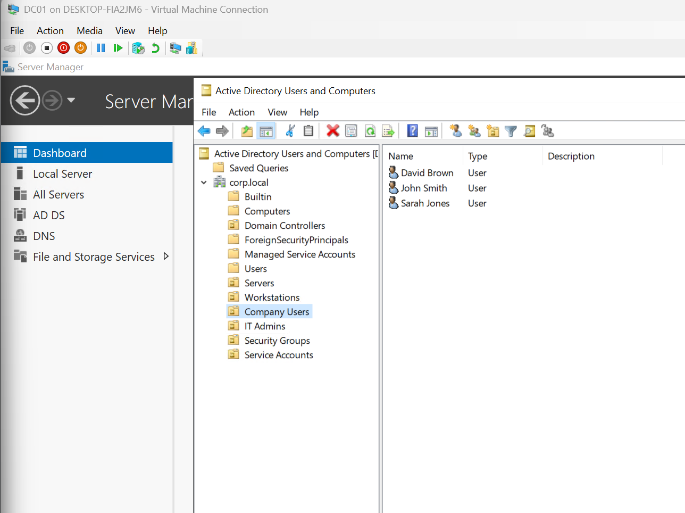
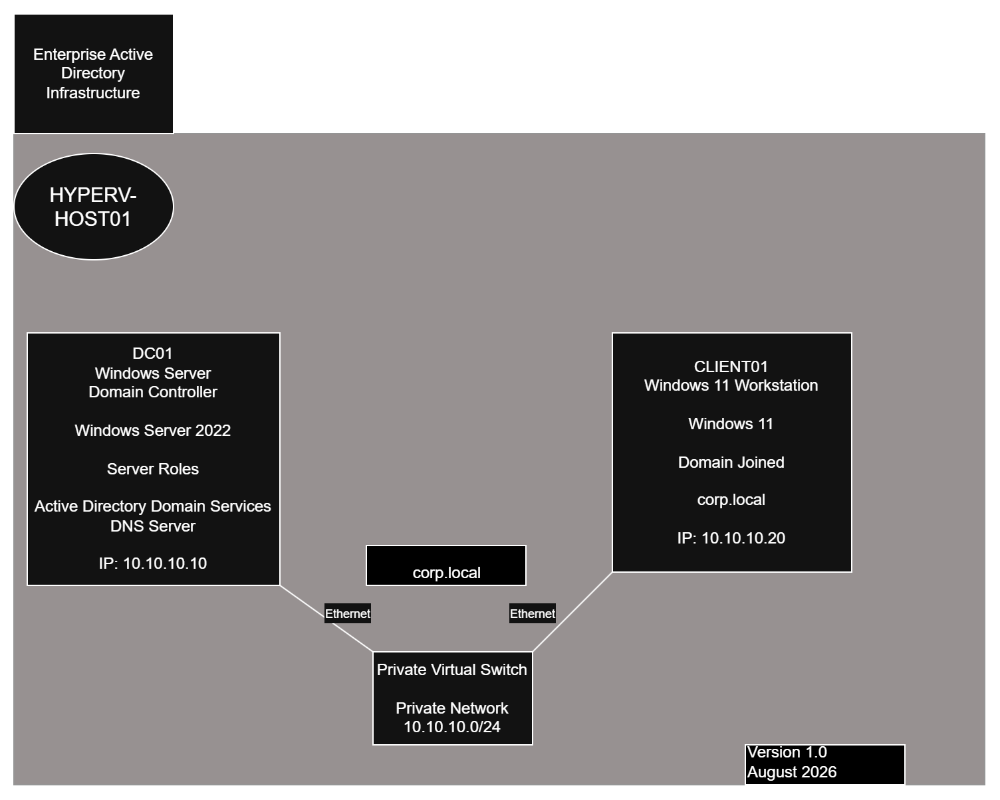

# Enterprise Active Directory Lab

## Project Overview

This project demonstrates the deployment of an enterprise Active Directory environment using Microsoft Windows Server within a Hyper-V virtualised infrastructure.

The objective of the project was to build and administer a secure Windows domain from scratch while gaining practical experience with enterprise identity management, DNS, Group Policy, user administration and Windows infrastructure.

This lab simulates the type of Active Directory environment commonly found in enterprise IT and Critical National Infrastructure (CNI) organisations.

---

## Technologies

- Windows Server
- Active Directory Domain Services (AD DS)
- DNS
- Hyper-V
- Windows 11
- Group Policy
- PowerShell
- Microsoft Management Console (MMC)

---

## Skills Demonstrated

- Active Directory Administration
- Domain Controller Deployment
- DNS Configuration
- User and Group Management
- Organisational Unit (OU) Design
- Windows Server Administration
- Hyper-V Virtualisation
- Security Group Administration
- Windows Infrastructure Support

---

## Lab Architecture

- Hyper-V Host
- Domain Controller (DC01)
- Windows Client (CLIENT01)
- Private Virtual Network

---

## Project Screenshots

### Hyper-V Environment

---

### Server Manager

---

### Active Directory Domain Services

---

### Organisational Unit Structure

---

### Company Users

---

## Future Improvements

- Group Policy configuration
- Password policies
- Network shares
- DNS troubleshooting
- DHCP deployment
- PowerShell automation
- Security auditing
- Windows Event Log monitoring
- ## Enterprise Lab Architecture

The lab consists of:

- Windows Server 2022 Domain Controller
- Active Directory Domain Services
- DNS Server
- Windows 11 Domain Joined Workstation
- Hyper-V Virtual Switch
- Private Virtual Network (10.10.10.0/24)

### Architecture Diagram

---
